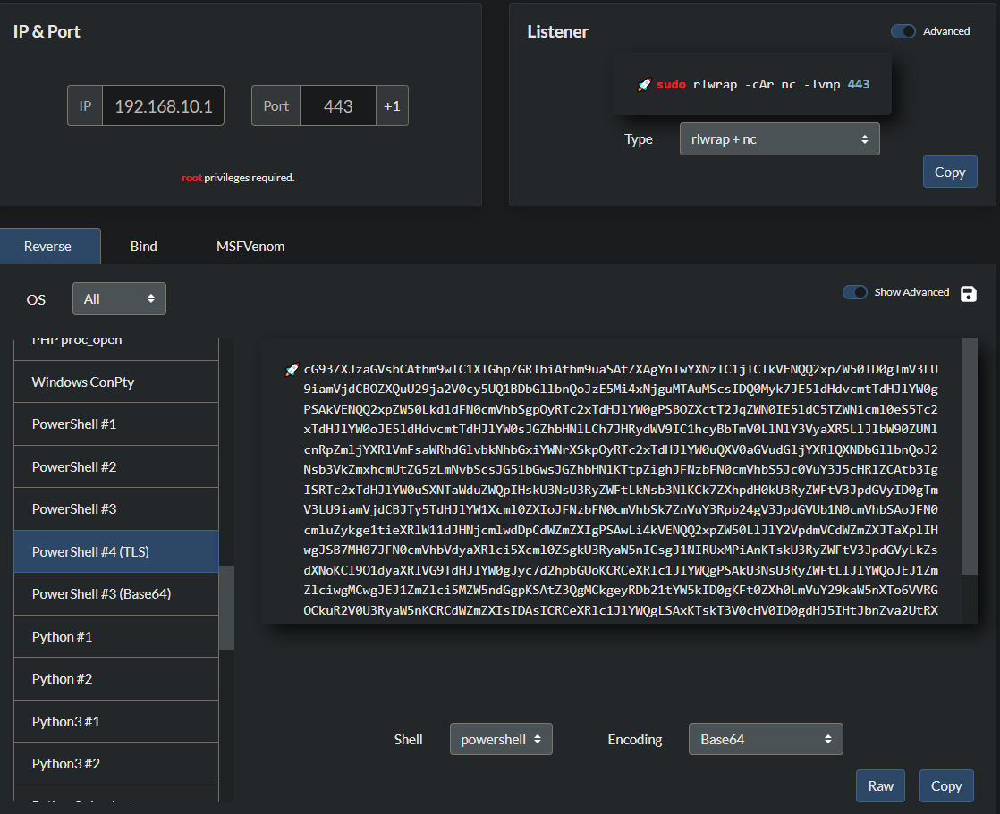

# Lab - Find the Secret Server


## Lab Environment

In this lab environment, the user is going to get access to a Kali GUI instance. The Kali instance is connected to the 10.175.88.0/24 network. There are three more networks, in each network, there is a web server (you can access it by browsing its IP address with your web browser) with the following IP addresses: 172.16.88.81, 192.168.241.12, and 192.168.222.199.

**Objective:** Configure the routes on the Kali instance to reach all the hosts in the networks!

## Instructions

* Use **eth1** interface of Kali instance for accessing other hosts in the networks.
* Do not attack the gateway machines located at IP address 10.175.88.1, 172.16.88.1, 192.168.241.1 and 192.168.222.1

## My Solution

Since the lab is about manually adding network routes, I looked up on google "how to add a route in linux" and used this easy-to-follow article



In order to see the routes already defined on your machine, use the “**ip route**” command with no arguments or abbreviated “ip r” command

```
ip r
```

From that we see the following

 (1).png>)

We can reach both `172.16.88.81` and `192.168.241.12` but clearly we cannot reach the secret `192.168.222.199` server

.png>)

So how do we fix this? Simply enter the following command

```
ip route add 192.168.222.0/24 via 10.175.34.1
```

Now we should be able to reach the secret server via the 10.175.34.1 gateway since we've linked that network to ours



.png>)

## INE Solution

**Step 1:** Open the lab link to access the Kali GUI instance.


**Step 2:** Open the terminal by clicking the terminal icon on the taskbar.


**Step 3:** Identify the IP address of the Kali Instance.

**Command**

```
ip addr
```


The IP address of the Kali instance is 10.175.34.140 and the subnet mask is 24.

**Step 4:** Check the routes on the Kali Instance.

**Command**

```
route
```


The Kali instance is connected to the 10.175.34.0/24 network and the last two routes (6th and 7th line of the output) facilitate communication to the machines on 172.16.88.0/24 and 192.168.241.0/24 networks.

**Step 5:** Access the webserver on the 172.16.88.0/24 network. Open the web browser and navigate to`http://172.16.88.81`


The webserver on the 172.16.88.0/24 network is accessible through the Kali instance.

**Step 6:** Access the webserver on the 192.168.241.0/24 network. In the web browser, navigate to`http://192.168.241.12`.


The web server on the 192.168.241.0/24 network is accessible through the Kali instance.

**Step 7:** Access the webserver on the 192.168.222.0/24 network. In the web browser, navigate to`http://192.168.222.199`.


Since there are no routes to access the machines on the 192.168.222.0/24 network. The secret server is not accessible through the Kali instance.

**Step 8:** Manually add the route to access the machines on the 192.168.222.0/24 network.

**Command**

```
ip route add 192.168.222.0/24 via 10.175.34.1
route
```


The route was added successfully.

**Step 9:** Access the secret server. In the web browser navigate to`http://192.168.222.199`


Successfully accessed the secret server.

**And that's how routes can be added to access other networks.**
